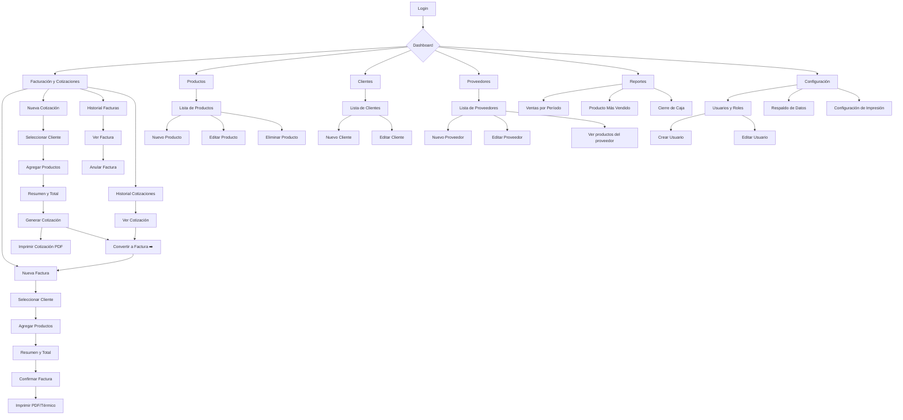

# Fase 2: App Flow — Efi- Pos

## Mapa de Navegación

---

## Matriz de Estados por Rol

| Pantalla | Dueño | Admin | Cajero |
|----------|-------|-------|--------|
| Dashboard | ✅ | ✅ | ✅ |
| Facturación (nueva) | ✅ | ✅ | ✅ |
| Cotizaciones (nueva) | ✅ | ✅ | ✅ |
| Convertir cotización a factura | ✅ | ✅ | ✅ |
| Anular factura | ✅ | ✅ | ❌ |
| Productos (CRUD) | ✅ | ✅ | ❌ solo ver |
| Clientes (CRUD) | ✅ | ✅ | ✅ |
| Proveedores (CRUD) | ✅ | ✅ | ❌ |
| Reportes | ✅ | ✅ | ❌ |
| Configuración | ✅ | ❌ | ❌ |
| Usuarios | ✅ | ❌ | ❌ |
| Respaldo BD | ✅ | ✅ | ❌ |

---

## Matriz de Estados por Conectividad

| Acción | Online | Offline |
|--------|--------|---------|
| Login | ✅ | ✅ (credenciales cacheadas) |
| CRUD Productos | ✅ | ✅ (local) |
| CRUD Clientes | ✅ | ✅ (local) |
| Crear Factura | ✅ | ✅ (local, sincroniza después) |
| Crear Cotización | ✅ | ✅ (local, sincroniza después) |
| Ver Historial | ✅ | ✅ (datos cacheados) |
| Imprimir | ✅ | ✅ |
| Reportes | ✅ | ❌ (solo datos cacheados) |
| Respaldar BD | ✅ | ❌ |

---

## Flujo de Excepciones

- **Sin conexión:** La app muestra un indicador "Offline" en la barra superior. Todas las operaciones se guardan en IndexedDB. Al recuperar conexión, sincroniza automáticamente.
- **Stock insuficiente:** Al agregar producto a factura con cantidad > stock disponible, muestra alerta y no permite agregar más del stock actual.
- **Factura anulada:** Se marca como "Anulada" en el historial, no se elimina. El stock se reincorpora automáticamente.
- **Campos vacíos:** Validación en todos los formularios antes de guardar.
- **Cierre de caja:** Si hay facturas offline sin sincronizar, no permite cerrar caja hasta sincronizar.

---

¿Aprobado? Pasamos a **Fase 3 (UI/UX)** ✍️
