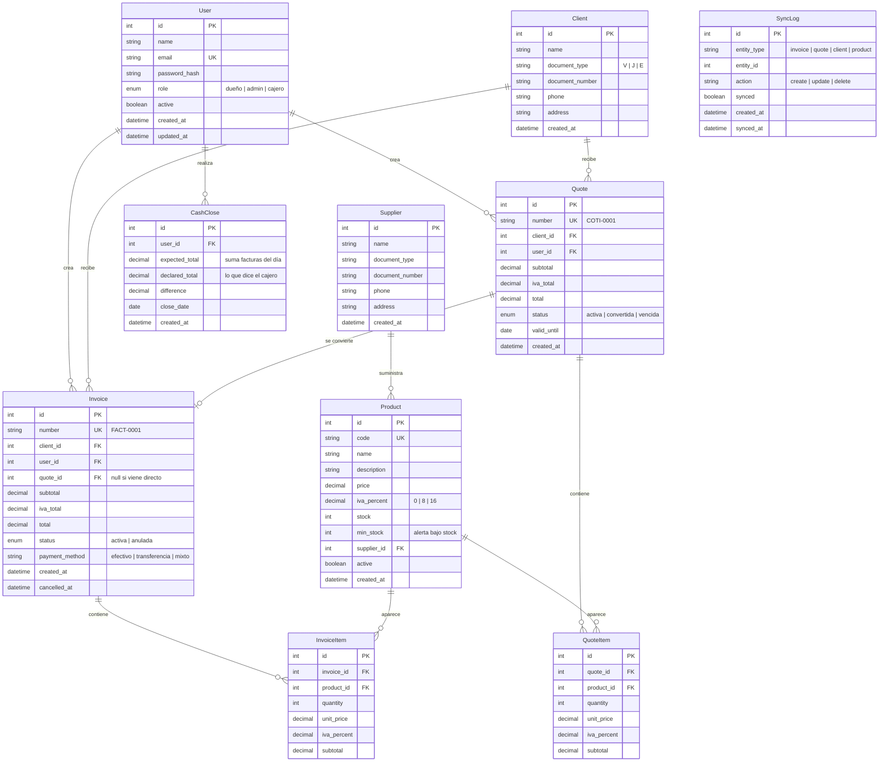

# Fase 5: Esquema Backend — Efi- Pos

## Modelo Entidad-Relación (ERD)



---

## Especificación de APIs

### Base URL: `/api/v1`

### Autenticación

| Método | Ruta | Descripción |
|--------|------|-------------|
| POST | `/auth/login` | Iniciar sesión |
| POST | `/auth/logout` | Cerrar sesión |
| GET | `/auth/me` | Perfil del usuario actual |
| PUT | `/auth/password` | Cambiar contraseña |

**POST /auth/login**
```json
// Request
{ "email": "carlos@efipos.com", "password": "123456" }

// Response 200
{
  "token": "eyJhbGci...",
  "user": { "id": 1, "name": "Carlos", "role": "dueño" }
}
```

### Usuarios (solo dueño)

| Método | Ruta | Descripción |
|--------|------|-------------|
| GET | `/users` | Listar usuarios |
| POST | `/users` | Crear usuario |
| PUT | `/users/:id` | Editar usuario |
| DELETE | `/users/:id` | Desactivar usuario |

**POST /users**
```json
// Request
{ "name": "María", "email": "maria@efipos.com", "password": "123456", "role": "cajero" }

// Response 201
{ "id": 2, "name": "María", "email": "maria@efipos.com", "role": "cajero", "active": true }
```

### Clientes

| Método | Ruta | Descripción |
|--------|------|-------------|
| GET | `/clients` | Listar clientes (con búsqueda ?q=) |
| GET | `/clients/:id` | Ver cliente |
| POST | `/clients` | Crear cliente |
| PUT | `/clients/:id` | Editar cliente |
| DELETE | `/clients/:id` | Eliminar cliente |

**POST /clients**
```json
// Request
{ "name": "Juan Pérez", "document_type": "V", "document_number": "12345678", "phone": "04121234567" }

// Response 201
{ "id": 1, "name": "Juan Pérez", "document_type": "V", "document_number": "12345678" }
```

### Proveedores

| Método | Ruta | Descripción |
|--------|------|-------------|
| GET | `/suppliers` | Listar proveedores |
| GET | `/suppliers/:id` | Ver proveedor + sus productos |
| POST | `/suppliers` | Crear proveedor |
| PUT | `/suppliers/:id` | Editar proveedor |
| DELETE | `/suppliers/:id` | Eliminar proveedor |

### Productos

| Método | Ruta | Descripción |
|--------|------|-------------|
| GET | `/products` | Listar productos (?q=&supplier_id=&low_stock=true) |
| GET | `/products/:id` | Ver producto |
| POST | `/products` | Crear producto |
| PUT | `/products/:id` | Editar producto |
| DELETE | `/products/:id` | Desactivar producto |

**POST /products**
```json
// Request
{
  "code": "ARR001",
  "name": "Arroz 1kg",
  "price": 1.20,
  "iva_percent": 16,
  "stock": 50,
  "min_stock": 10,
  "supplier_id": 1
}

// Response 201
{ "id": 1, "code": "ARR001", "name": "Arroz 1kg", "price": 1.20, "stock": 50 }
```

### Cotizaciones

| Método | Ruta | Descripción |
|--------|------|-------------|
| GET | `/quotes` | Listar cotizaciones |
| GET | `/quotes/:id` | Ver cotización con items |
| POST | `/quotes` | Crear cotización |
| POST | `/quotes/:id/convert` | Convertir a factura |

**POST /quotes**
```json
// Request
{
  "client_id": 1,
  "valid_until": "2026-08-20",
  "items": [
    { "product_id": 1, "quantity": 3 },
    { "product_id": 2, "quantity": 1 }
  ]
}

// Response 201
{
  "id": 1,
  "number": "COTI-0001",
  "client": { "id": 1, "name": "Juan Pérez" },
  "subtotal": 9.70,
  "iva_total": 1.55,
  "total": 11.25,
  "items": [
    { "product": "Arroz 1kg", "quantity": 3, "subtotal": 3.60 },
    { "product": "Aceite", "quantity": 1, "subtotal": 2.50 }
  ],
  "status": "activa",
  "valid_until": "2026-08-20"
}
```

**POST /quotes/:id/convert**
```json
// Response 200
{
  "invoice_id": 1,
  "invoice_number": "FACT-0001",
  "message": "Cotización convertida a factura exitosamente"
}
```

### Facturas

| Método | Ruta | Descripción |
|--------|------|-------------|
| GET | `/invoices` | Listar facturas (?date_from=&date_to=&status=) |
| GET | `/invoices/:id` | Ver factura con items |
| POST | `/invoices` | Crear factura (directa o desde cotización) |
| POST | `/invoices/:id/cancel` | Anular factura (restaura stock) |
| GET | `/invoices/:id/print` | Obtener datos para impresión |

**POST /invoices**
```json
// Request (directa)
{
  "client_id": 1,
  "payment_method": "efectivo",
  "items": [
    { "product_id": 1, "quantity": 3 },
    { "product_id": 3, "quantity": 2 }
  ]
}

// Response 201
{
  "id": 1,
  "number": "FACT-0001",
  "client": { "id": 1, "name": "Juan Pérez" },
  "subtotal": 6.60,
  "iva_total": 1.06,
  "total": 7.66,
  "items": [ ... ],
  "status": "activa",
  "payment_method": "efectivo"
}
```

### Reportes

| Método | Ruta | Descripción |
|--------|------|-------------|
| GET | `/reports/sales?date_from=&date_to=` | Ventas por período |
| GET | `/reports/top-products?date_from=&date_to=&limit=` | Productos más vendidos |
| GET | `/reports/cash-close?date=` | Cierre de caja del día |

**GET /reports/sales?date_from=2026-07-01&date_to=2026-07-20**
```json
{
  "total_sales": 1245.00,
  "total_invoices": 45,
  "average_ticket": 27.67,
  "by_payment_method": {
    "efectivo": 980.00,
    "transferencia": 265.00
  },
  "daily_breakdown": [
    { "date": "2026-07-20", "total": 85.00, "count": 4 }
  ]
}
```

### Sincronización

| Método | Ruta | Descripción |
|--------|------|-------------|
| POST | `/sync/push` | Enviar datos locales al servidor |
| GET | `/sync/pull?since=` | Obtener cambios desde última sincronización |

**POST /sync/push**
```json
// Request
{
  "changes": [
    { "entity": "invoice", "action": "create", "data": { ... } },
    { "entity": "client", "action": "update", "data": { ... } }
  ]
}

// Response 200
{
  "results": [
    { "id_local": "uuid-1", "id_remoto": 5, "status": "synced" },
    { "id_local": "uuid-2", "id_remoto": null, "status": "error", "error": "..." }
  ]
}
```

---

## Procesos en Segundo Plano

### 1. Sincronización Offline
- **Trigger:** Al recuperar conexión (evento `online`)
- **Proceso:** Encola datos pendientes → envía batch a `/sync/push` → actualiza estado local
- **Conflicto:** Último write gana (timestamp comparado)

### 2. Vencimiento de Cotizaciones
- **Trigger:** Job programado (cron diario a las 00:00)
- **Proceso:** `UPDATE quotes SET status = 'vencida' WHERE valid_until < NOW() AND status = 'activa'`

### 3. Respaldo Automático
- **Trigger:** Semanal
- **Proceso:** Exportar BD remota → enviar a Cloudinary/drive → notificar al dueño

### 4. Alertas de Stock Bajo
- **Trigger:** Al crear/editar factura (descuento de stock)
- **Proceso:** Si stock < min_stock → registrar alerta → mostrar en dashboard

---

¿Aprobado? Pasamos a **Fase 6: Plan de Implementación (Roadmap + Tareas)** 🚀
