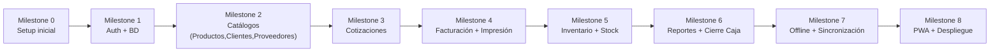

# Fase 6: Plan de Implementación — Efi- Pos

## Roadmap (Hitos)

---

## Checklist de Tareas Ejecutables

### ⚙️ Milestone 0: Setup Inicial
- [ ] Inicializar proyecto frontend (React + Vite + TypeScript)
- [ ] Configurar Tailwind CSS
- [ ] Inicializar proyecto backend (Node.js + Express + TypeScript)
- [ ] Configurar Prisma + PostgreSQL (modelos iniciales)
- [ ] Configurar ESLint + Prettier
- [ ] Crear estructura de carpetas del proyecto

### 🔐 Milestone 1: Auth + BD
- [ ] Crear modelo User en Prisma y migrar BD
- [ ] Implementar endpoint POST /auth/login
- [ ] Implementar middleware JWT
- [ ] Implementar middleware RBAC (roles)
- [ ] Crear página de Login en frontend
- [ ] Crear protección de rutas (PrivateRoute)
- [ ] Crear layout base con sidebar navigation

### 📦 Milestone 2: Catálogos (Productos, Clientes, Proveedores)
- [ ] Crear modelos Client, Supplier, Product en Prisma
- [ ] CRUD API de Clientes
- [ ] CRUD API de Proveedores
- [ ] CRUD API de Productos
- [ ] Página: Lista de Productos (búsqueda, filtros, stock bajo)
- [ ] Página: Nuevo/Editar Producto
- [ ] Página: Lista de Clientes (búsqueda)
- [ ] Página: Nuevo/Editar Cliente
- [ ] Página: Lista de Proveedores
- [ ] Página: Nuevo/Editar Proveedor

### 📋 Milestone 3: Cotizaciones
- [ ] Crear modelos Quote, QuoteItem en Prisma
- [ ] API: CRUD de Cotizaciones
- [ ] API: Convertir cotización a factura
- [ ] Página: Nueva Cotización (selector cliente + agregar productos)
- [ ] Cálculo automático de subtotal, IVA, total
- [ ] Página: Historial de Cotizaciones
- [ ] Página: Vista detalle de Cotización
- [ ] Impresión de Cotización (PDF)

### 🧾 Milestone 4: Facturación + Impresión
- [ ] Crear modelos Invoice, InvoiceItem, Payment en Prisma
- [ ] API: CRUD de Facturas
- [ ] API: Anular factura (restaura stock)
- [ ] Página: Nueva Factura (desde cero o desde cotización)
- [ ] Página: Historial de Facturas
- [ ] Página: Vista detalle de Factura
- [ ] Generar PDF de factura (jsPDF)
- [ ] Vista de impresión térmica (80mm/58mm)
- [ ] Botón imprimir / descargar PDF

### 📊 Milestone 5: Inventario + Stock
- [ ] Descontar stock al crear factura
- [ ] Restaurar stock al anular factura
- [ ] Alerta visual de stock bajo (badge en navbar + dashboard)
- [ ] Página: Productos con stock bajo (filtro low_stock)
- [ ] Historial de movimientos de stock (entradas/salidas)

### 📈 Milestone 6: Reportes + Cierre de Caja
- [ ] API: Reporte de ventas por período
- [ ] API: Productos más vendidos
- [ ] API: Cierre de caja
- [ ] Página: Reportes (cards + datos)
- [ ] Página: Cierre de caja (comparar esperado vs declarado)
- [ ] Dashboard con resumen de ventas del día

### 📡 Milestone 7: Offline + Sincronización
- [ ] Configurar IndexedDB con Dexie.js
- [ ] Cachear productos, clientes, proveedores offline
- [ ] Guardar facturas offline (estado pending)
- [ ] Cola de sincronización con reintentos
- [ ] Detectar cambio de conectividad (online/offline)
- [ ] Barra indicadora "Modo offline"
- [ ] Sincronización automática al recuperar conexión

### 📱 Milestone 8: PWA + Despliegue
- [ ] Configurar Vite PWA Plugin (manifest.json, service worker)
- [ ] Iconos y splash screen
- [ ] Probar instalación en Android
- [ ] Cache estático (App Shell)
- [ ] Desplegar frontend en Vercel
- [ ] Desplegar backend en Render
- [ ] Configurar dominio personalizado (opcional)
- [ ] Pruebas end-to-end en dispositivo real

---

## Definition of Done (DoD)

Cada tarea se considera completada cuando:
- [ ] Código escrito y funcional
- [ ] Se probó manualmente (al menos flujo feliz)
- [ ] No hay errores de TypeScript (`tsc --noEmit`)
- [ ] No hay errores de lint (`eslint .`)
- [ ] La funcionalidad offline no rompe nada online (y viceversa)
- [ ] La UI es responsive (móvil + tablet + desktop)

---

¡Eso es todo el plan! ¿Listo para empezar a escribir código?

¿Por cuál tarea del **Milestone 0** quieres comenzar?
