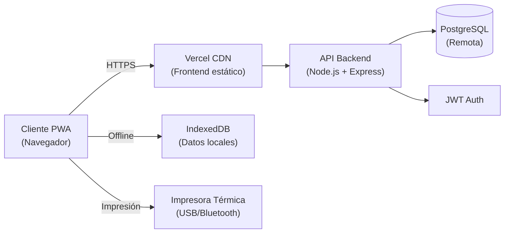
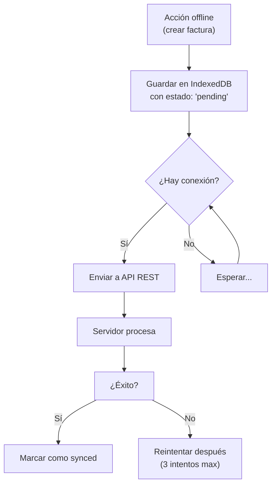

# Fase 4: TRD — Efi- Pos

## Tech Stack Recomendado

| Capa | Tecnología | Justificación |
|------|-----------|---------------|
| **Frontend** | React 18 + Vite | Rápido, liviano, ecosistema maduro, ideal para PWA |
| **Lenguaje** | TypeScript | Tipado seguro, menos bugs en producción |
| **Estilos** | Tailwind CSS | Desarrollo rápido, responsive nativo, bundle pequeño |
| **PWA** | Vite PWA Plugin (Workbox) | Service Workers, manifest, offline caching automático |
| **Estado global** | Zustand | Simple, sin boilerplate, persistencia offline fácil |
| **BD Local (offline)** | Dexie.js (IndexedDB) | SQL-like en el navegador, funciona offline |
| **BD Remota** | PostgreSQL | Robusto, gratuito, ideal para datos contables |
| **Backend API** | Node.js + Express | Mismo lenguaje que frontend, rápido de desarrollar |
| **ORM** | Prisma | Tipado automático, migraciones, relaciones |
| **Autenticación** | JWT (jsonwebtoken + bcrypt) | Simple, sin dependencias externas, stateless |
| **Impresión térmica** | qz-tray o Web Serial API | Puerto serie/USB para impresoras térmicas |
| **PDF** | jsPDF + html2canvas | Generación de PDFs desde el frontend (offline-ready) |
| **Despliegue** | Vercel (frontend) + Railway/Render (backend) | Gratis para empezar, escalable |
| **Almacenamiento archivos** | Cloudinary o local (multipart) | Respaldos de BD |

---

## Estrategia de Seguridad

### Autenticación
- JWT con expiración (24h por defecto)
- Refresh token rotatorio
- Contraseñas hasheadas con bcrypt (salt rounds: 12)
- Rate limiting en login (5 intentos → bloqueo 15min)

### Autorización (RBAC)
```
Roles: dueño > admin > cajero
```
- Middleware verifica rol en cada ruta protegida
- El frontend oculta opciones según rol (seguridad en backend)

### Datos sensibles
- En tránsito: HTTPS obligatorio
- En reposo: Datos contables sensibles en BD remota con cifrado
- Locales: IndexedDB protegida por origen (same-origin policy)
- No almacenar tokens en localStorage — usar httpOnly cookies o sessionStorage

### Offline
- Datos locales cifrados con `crypto.subtle` si contiene información sensible
- Sincronización con ID de conflicto (último write gana por defecto)

---

## Infraestructura



| Componente | Proveedor | Plan sugerido | Costo |
|-----------|-----------|---------------|-------|
| Frontend (PWA) | Vercel | Hobby (gratis) | $0 |
| Backend API | Render | Free tier | $0 |
| Base de datos | Render PostgreSQL | Free tier (512MB) | $0 |
| Dominio | cualquiera | .com.ve o .com | ~$10/año |

### Estrategia de Despliegue
1. **Frontend:** Build estático → deploy a Vercel (CDN global)
2. **Backend:** API REST en Render con auto-deploy desde GitHub
3. **BD:** PostgreSQL administrada en Render
4. **CI/CD:** GitHub Actions → test → deploy automático

### Monitoreo
- **Errores frontend:** Sentry (free tier)
- **Logs backend:** Console + Winston (archivos rotativos)
- **Uptime:** Better Uptime o Upptime (free)

---

## Sincronización Offline



### Modelo de datos offline
```
Factura {
  id_local: "uuid-v4"
  id_remoto: null | number
  cliente: { id, nombre }
  items: [{ producto_id, cantidad, precio }]
  total: number
  estado: "pending" | "synced" | "error"
  created_at: timestamp
  updated_at: timestamp
}
```

---

¿Aprobado? Pasamos a **Fase 5: Esquema Backend (BD + APIs)** 💾
